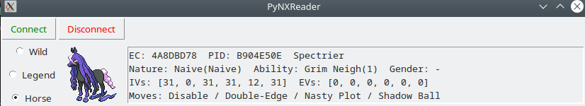
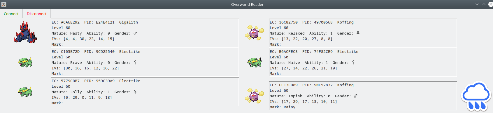
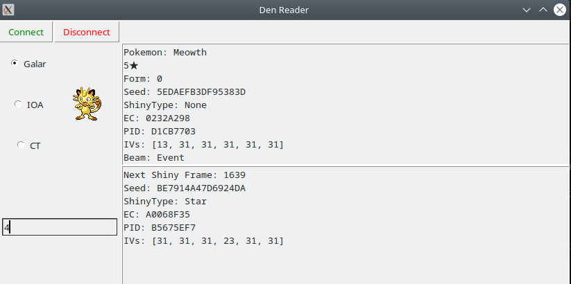
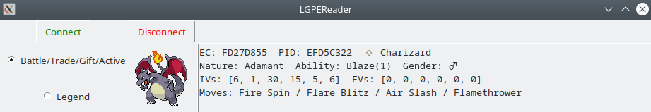

# PyNXReader
 Python Lib for reading information from Pokemon Sword and Shield and LGPE

 This library is more focused on reading information for hunting/overlays/just knowing the info as opposed to botting.

 This is a fork of PyNXBot by [wwwwwwzx](https://github.com/wwwwwwzx) so credit to them and other who worked on the original project!

## Warning
 I won't be liable if your Switch get damaged or banned. Use at your own risk.

## Images
 
 
 
 

## Features
 * Check Den info
 * Check Wild Pokémon info
 * Check Legendary Pokémon info
 * Check Calyrex Fusion Pokémon info
 * Check Party Pokémon info
 * Check Box Pokémon info
 * Check Save info
 * Check Overworld Pokémon info
 * Check LGPE Battle/Trade/Gift/Legendary/Active (Summary Screen, etc.) Pokémon info

## Requirements
* [Python](https://www.python.org/downloads/)
	* Install z3-solver, pyserial, pyusb, pillow, pokebase, numpy, and discord via [pip](https://pip.pypa.io/en/stable/) if `ImportError` happens.
	   `pip install z3-solver` 
	   `pip install pyserial`
	   `pip install pyusb`
	   `pip install pillow`
	   `pip install pokebase`
	   `pip install numpy`
	   `pip install discord`
* CFW
* Internet Connection
* [sys-botbase](https://github.com/olliz0r/sys-botbase)
* [joycon-sys-botbase](https://github.com/Manu098vm/sys-botbase) For LGPE (you can only use one sys-botbase at a time)
* [ldn_mitm](https://github.com/spacemeowx2/ldn_mitm)

## Usage
* The scripts to run are contained in the ./tests/ folder
* Use [CaptureSight](https://github.com/zaksabeast/CaptureSight/)/CheckDen script to check your Den id for the Den scripts
* Scripts labeled "Check'name'.py" will display info on that type of encounter in the console
* "GUIReader.py" Is the script you need to run if you want GUI reading of Wild/Legendary/Fusion Pokémon for SWSH or Battle/Trade/Gift/Legendary/Active Pokémon for LGPE.
* "GUIOverworld.py" Is the script you need to run if you want GUI reading of Overworld Pokémon
* The other scripts are for dumping info and can be mostly ignored for the average person

### Usage: Overworld Scanner Discord Bot
Prerequisite of a discord bot account and a discord server.

In order to run the bot do the following:
1. Copy *config.template.json* to *config.json*
2. Fill out *config.json* with appropriate values.
3. Execute *tests/OverworldDiscordBot.py*
4. From the discord server, run the *$download_emoji* command, download the marks zip, and add them to your server.
5. After the marks are added, you can run the *$start* command to start the bots scanner thread.
* $start is used to start the scanner thread
* $stop is used to close the scanner thread
* $restart is used to close then re open the scanner thread
* $shutdown is used to close the scanner thread and the discord bot

## Credits:
* olliz0r for his great [sys-botbase](https://github.com/olliz0r/sys-botbase) which let open sockets on the Nintendo Switch
* spacemeowx2 for his livesafer [sys-module](https://github.com/spacemeowx2/ldn_mitm). It avoids Switch to disconnect from wifi once game is opened
* Admiral-Fish for his great app [RaidFinder](https://github.com/Admiral-Fish/RaidFinder) always up to date
* zaksabeast for his great SwSh Switch tool [CaptureSight](https://github.com/zaksabeast/CaptureSight/) (many addresses/checks are taken from there)
* Leanny for his great plugin [PKHeX_Raid_Plugin](https://github.com/Leanny/PKHeX_Raid_Plugin/tree/master/PKHeX_Raid_Plugin) (many addresses/checks are taken from there)
* Kurt for his great app [SysBot.NET](https://github.com/kwsch/SysBot.NET) (many addresses/checks are taken from there)
* [wwwwwwzx](https://github.com/wwwwwwzx) for creating and working on the original project
* [Real96](https://github.com/Real96) for working on the original project
* [Manu098](https://github.com/Manu098vm/) for Sys-EncounterBot (many addresses/checks are taken from there)
* [JSB](https://github.com/jsb-pokemon) for a lot of work on the discord bot!

## Possible Future Improvements
### PRs and help with these is always appreciated
### Discord
- [ ] Cleanup: Set embed_color via config file.
- [x] Cleanup: Set bot_prefix via config file.
- [ ] Cleanup: Migrate non-class utility functions to a utility class.
- [ ] Cleanup: Have shutdown/start commands edit the same message to avoid spamming chat
- [ ] Documentation: Expand discord bot readme section to include a comprehensive guide
- [ ] Feature: Discord help command
- [ ] Feature: Update the configuration and reload it via discord command
- [x] Feature: Bot command to install emoji pack in a discord server
- [ ] Feature: Add a filtering class to enable complex filters instead of a set of flags
- [ ] Feature: Save statistics and display aggregate stats. Examples include: pokemon encounters, mark #s, shiny #s, etc.
- [ ] Feature: Use the bot "activity" to update how many overworld pokemon have been scanned
- [ ] Feature: include watchers to ping alongside filters. Is this useful for a bot attached to a single switch?
- [ ] Feature: Make changing the formatting on the event cards easy for non-technical users.
- [ ] Feature: Discord bot/mode for eggs
- [ ] Feature: Discord bot/mode for lgpe
- [ ] Feature: Discord bot/mode for other read things
- [ ] Feature: Command to combine all .encounters files for statistics
### SysDVR
- [ ] Feature: Introduce SysDVR Support
- [ ] Feature: Screenshot and Video Functionality
- [ ] Feature: Overlay that can read various things
- [ ] Feature: Make overlay fancy (pcalc inspiration?)
- [ ] Feature: Keyboard and input support?
### Other
- [ ] Documentation: Full detailed guides on using tools
- [ ] Feature: Dynamax Adventure reading
- [ ] Feature: Gift Pokemon reading
- [x] Feature: Egg reading
- [ ] Feature: GUI for Egg reading
- [ ] Feature: Dex Rec Reading
- [ ] Feature: (not likely) On the fly catch rate calculator
- [ ] Feature: (minor) KO Counter Reading
- [ ] Upgrade: Change GUI to something like PyQT